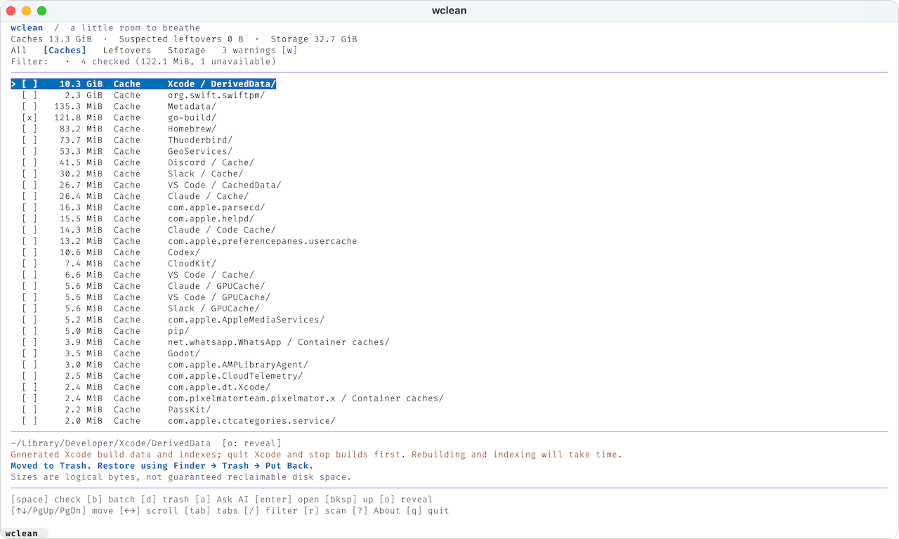

# wclean

A local macOS cleaner with a Go terminal interface. Inspect first, remove one item at a time, recover through Finder. No subscription, daemon, telemetry, root access, or permanent-delete command.

Leftover detection is conservative and heuristic. Review every candidate before removing it.



## Run

Requires macOS and Go 1.27.1 or newer. The TUI needs an interactive terminal; `clean` does not.

```sh
go build -o wclean .
./wclean

./wclean --theme light|dark                  # if background detection fails
./wclean --apps "$HOME/Tools:/Volumes/Ext"   # extra app locations
./wclean clean [--yes]                       # remove remembered caches
```

Light/dark colors follow the terminal background detected at startup by Lip Gloss. Colors supplement labels and the `>` cursor, never replace them.

## Keys

| Key | Action |
| --- | --- |
| ↑ ↓ / k j / PgUp PgDn | Move through findings or warnings |
| ← → | Scroll the focused line horizontally |
| Enter / Backspace | Open the focused directory / go up, ending at findings |
| Tab / Shift+Tab | All / Caches / Leftovers / Storage |
| `/` | Filter paths and app labels; Enter applies, Escape clears |
| Space | Toggle the checkbox; unchecking also forgets saved cache rules |
| `b` | Preview and confirm a batch of checked items |
| `d` | Move the focused item to Trash after confirmation |
| `a` | Explain the focused item using an installed AI CLI |
| `o` / `r` / `w` / `?` | Reveal in Finder / rescan / warnings / About |
| `q` / Ctrl+C | Quit, except while a Trash operation is pending |

Minimum terminal size is 48 × 18. Removal always requires an explicit `y` in a confirmation showing the full path; Enter cancels. Storage entries are marked `[danger]` and can break apps or macOS services — removing them is your deliberate choice, not a recommendation. Partial scans are marked `>=` and cannot be removed whole, though fully scanned children can. Permission failures become warnings rather than silently empty directories.

Directory browsing and sizing are asynchronous. Children inherit their finding's category and safeguards; inside Storage, an exactly recognized cache directory becomes a Cache. A successful move updates the cached listing and totals in place — press `r` to rescan from disk. Removing a child never touches its parent or siblings. Symlinks and special files are skipped, and navigation cannot escape into unrelated directories.

macOS may ask your terminal for Automation permission to control Finder on the first removal. Denial is reported; there is no permanent-delete fallback. Close the owning app before removing its data.

## Remembered caches and batch removal

A successfully removed **Cache** entry is remembered by its exact path in `~/Library/Application Support/wclean/remembered-caches.json`. Leftovers and Storage are never learned automatically.

- `[ ]` unchecked, `[x]` checked (possibly through an enclosing selection), `[~]` some descendants checked.
- The filter line totals the selection as `4 checked (107 B, 1 unavailable)`. The size counts each checked parent once, never its subsumed descendants, and unavailable placeholders contribute nothing.
- Space checks an item for this session, or clears that selection, its descendants, and any enclosing selection. Matching remembered rules are deleted immediately.
- Remembered caches stay checked across scans. Missing paths **remain saved** and are retried every batch; unavailable ones appear as checked placeholders you can uncheck to forget.
- Manual checks survive navigation and filtering but reset on rescan. Only successful Cache removal saves a path. A successful removal also drops that path and its descendants from the current checks, so a removed Leftover never returns — it is neither checked nor remembered if its app is reinstalled.
- `[b]` previews paths, sizes, missing entries, and errors. Checked parents subsume their children. Only `[y]` starts; removal is sequential with the usual per-item checks. Escape stops after the current item.

`wclean clean` uses only remembered Cache paths, asks for `y` unless `--yes`, skips missing paths without forgetting them, and exits nonzero on errors. Symlinked, malformed, oversized, or non-cache preference entries are rejected, and a corrupt file is never overwritten with an empty set.

## What gets scanned

- `~/Library/Caches`: every immediate entry except `kitty`.
- Named app caches: `Cache`, `Code Cache`, `GPUCache` under `Application Support/Code`, `discord`, `Claude`, and Slack's container, plus VS Code's `CachedData`/`CachedExtensionVSIXs` and `Arduino15/staging`.
- Xcode `DerivedData` and `DocumentationCache`.
- Container caches at `~/Library/Containers/<bundle-ID>/Data/Library/Caches` for non-Apple IDs.
- **Leftover** candidates: reverse-DNS entries in `Preferences`, `Application Support`, and `Saved Application State` with no matching installed bundle ID, plus superseded JetBrains/Google IDE version folders. Two-component IDs count only behind a TLD-like first label (`org.example`, never `krita.log`). A human-named entry qualifies only when it exactly matches the trailing component of such an unclaimed ID — `org.example.plist` vouches for a sibling folder named `example` — and never when that component is short or shared with an installed app. Because any framework, installer, or JVM can write a preference domain, a `Preferences` or `Saved Application State` entry is reported only beside the `Application Support` leftover it accompanies. Also excluded: Apple and app-group domains (`group.com.apple.mail`), IDs inside an installed app's own namespace (`com.vendor.app.helper` while `com.vendor.app` is installed), unvouched human-named folders, and directories referenced by an installed IDE's `product-info.json`.
- App inventory: `/Applications`, `/System/Applications`, `/System/Library/CoreServices`, `~/Applications`, and `--apps` locations, read with `plutil`. An unreadable location, a malformed `Info.plist`, or a non-string `CFBundleIdentifier` disables leftover detection for that scan; a readable bundle that declares no `CFBundleIdentifier` at all owns no reverse-DNS data and is skipped with a warning instead.
- **Storage** (inspection first, `[danger]` to remove): everything under `~/Library/Developer/Xcode`, `Containers`, and `Group Containers`, plus `~/Library/Logs`, `~/.konan`, `~/.lldb`, `~/.m2`, `~/.gradle`.

Cache rules exclude Service Worker storage, profiles, history, sessions, backups, and installed packages. Storage sizes include nested caches shown separately and are never counted as leftovers.

Absence of a matching bundle ID is evidence for review, not proof that deletion is safe: helpers, shared vendor data, and apps in unscanned locations all cause false positives. An app that changed its bundle ID between versions is indistinguishable from a removed one — data left under the old domain is reported even though the app is installed under the new one. Sizes are logical bytes without following symlinks, so clones, compression, and hard links make actual reclaimed space differ.

Before each removal wclean rechecks the category boundary, canonical parent, item identity, modification time, size, scan completeness, ancestors up to the detected root, and IDE ownership. Finder then performs the native Trash operation, preserving Put Back metadata. This is **not an atomic transaction** — do not use it on adversarial or shared writable trees.

Never touched: `/Library`, Mail, Photos, browser history, Keychains, backups, the Trash itself, hidden top-level entries, and redirected category folders. No background cleanup.

## AI explanations

`[a]` opens a popup that finds **Claude Code, Codex, and pi** on `PATH`. Choose a client with ← →, review the exact prompt, and press Enter to send “What is stored here?”. Escape cancels.

The prompt contains only the path (home as `~`), category, size, scan completeness, and up to 20 immediate child names — **never file contents**. Names can be sensitive, so review before sending; the client may contact a remote provider and consume paid quota.

Clients use their existing authentication, run in a private temporary directory with sessions off, and have tools, hooks, skills, MCP, and extensions disabled. Replies are plain text, capped at 64 KiB, and time out after two minutes. Advice never changes findings or deletion permissions.

`~/Library/Containers/com.apple.CoreDevice.CoreDeviceService/.../AppInstallationBinaryDeltas` is browsable through Storage but is not a verified cleanup target: `xcrun devicectl` offers no cleanup command and its regeneration behavior is unknown.

## Design

Bubble Tea handles input and async work; Lip Gloss supplies the adaptive palette — blue/cyan for emphasis, orange/gold for cautions, crimson/rose for errors and Trash actions. The layout runs summary → tabs/filter → size-ranked list → details → keys. Findings are the unit of removal, not whole apps.

The UI separates **cache data**, **suspected leftovers**, **storage**, and **warnings** instead of one "junk" score. No reclaimed-space promises or health ratings. Failed removals stay visible for retry.

Possible next steps: a persistent ignore list, ownership history recorded while apps are installed, a large/old files explorer, simulator and package-manager caches, duplicate review, an app uninstall preview, and a read-only startup-item overview. Malware scanning, "RAM cleaning", and blanket maintenance scripts are out of scope.

## Development

```sh
go test ./... && go vet ./... && go build -o wclean .
```

Tests use temporary files and fake AI clients; they never invoke the real Trash or send paid requests. Native Finder removal, client authentication, and interactive rendering need manual verification.

## License

Code: MIT © 2026 Nikita Denin. See [LICENSE](LICENSE).

The logo (`wclean.png`) is **not** covered by the MIT license. © 2026 Nikita Denin, all rights reserved — no use, reproduction, or modification without written permission.
